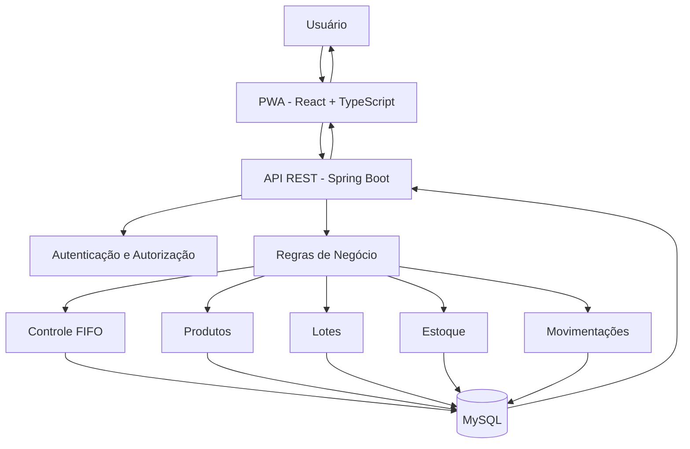

# 📦 PWA Web para Controle Descentralizado de Estoque FIFO

Sistema Web responsivo desenvolvido para realizar o **controle descentralizado de estoque**, permitindo o gerenciamento de produtos, lotes e movimentações de estoque utilizando o método **FIFO (First In, First Out)**.

O projeto tem como objetivo desenvolver uma aplicação para controle de estoque, aplicando conceitos de **desenvolvimento de sistemas, arquitetura de software, banco de dados, segurança, desenvolvimento Web, PWA e regras de negócio**.

---

## 👥 Integrantes

* **Ferdinando Rainert**

> Caso o projeto possua outros integrantes, adicionar os respectivos nomes nesta seção.

---

## 🎯 Objetivo do Projeto

O sistema tem como objetivo centralizar e organizar o controle de estoque de diferentes setores ou unidades, permitindo o acompanhamento das entradas e saídas de produtos.

A principal regra de negócio do sistema é a utilização do método **FIFO (First In, First Out)**, no qual os produtos que entraram primeiro no estoque devem ser priorizados nas saídas.

O sistema busca reduzir inconsistências no controle manual de estoque e facilitar a visualização da quantidade disponível, dos lotes existentes e do histórico de movimentações.

---

# 📌 Escopo do MVP

O **MVP (Minimum Viable Product)** será desenvolvido com foco nas funcionalidades essenciais para realizar o controle de estoque utilizando a regra FIFO.

## ✅ O que o sistema faz no MVP

O MVP deverá permitir:

* Cadastro de produtos;
* Consulta de produtos;
* Alteração de produtos;
* Inativação de produtos;
* Cadastro de lotes;
* Controle da quantidade disponível por lote;
* Registro da data de entrada dos lotes;
* Controle da validade dos lotes;
* Registro de entradas de estoque;
* Registro de saídas de estoque;
* Consulta do saldo disponível;
* Controle de estoque por unidade ou setor;
* Aplicação automática da regra FIFO;
* Registro do histórico das movimentações;
* Identificação do lote utilizado em uma saída;
* Identificação do usuário responsável pela movimentação;
* Autenticação dos usuários;
* Controle de acesso por perfil;
* Interface responsiva para computadores e dispositivos móveis.

---

## ❌ O que o sistema não faz no MVP

As seguintes funcionalidades **não fazem parte do escopo inicial do MVP**:

* Emissão de notas fiscais;
* Controle financeiro;
* Controle contábil;
* Integração com sistemas ERP externos;
* Integração com sistemas de fornecedores;
* Integração com sistemas de compras;
* Geração automática de pedidos de compra;
* Inteligência artificial para previsão de demanda;
* Previsão automática de reposição de estoque;
* Integração obrigatória com leitores de código de barras;
* Integração com impressoras fiscais;
* Integração com sistemas contábeis;
* Relatórios gerenciais avançados;
* Dashboards analíticos avançados;
* Integração com sistemas externos de terceiros.

Essas funcionalidades poderão ser analisadas e implementadas em versões futuras do sistema.

---

# 📦 Regra FIFO

O método **FIFO (First In, First Out)** determina que os produtos mais antigos sejam utilizados antes dos produtos mais recentes.

No sistema, cada entrada de produto poderá gerar um lote. Quando uma saída for realizada, o sistema deverá identificar os lotes disponíveis e iniciar a baixa pelo lote com a data de entrada mais antiga.

### Exemplo

Considerando os seguintes lotes:

| Lote | Data de Entrada | Quantidade |
| ---- | --------------- | ---------: |
| L001 | 01/09/2026      |         10 |
| L002 | 05/09/2026      |         20 |
| L003 | 10/09/2026      |         15 |

Se for realizada uma saída de **15 unidades**, o sistema deverá utilizar:

```text
L001 → 10 unidades
L002 → 5 unidades
```

Resultado:

```text
L001 → 0 unidades
L002 → 15 unidades
L003 → 15 unidades
```

Dessa forma, o lote mais antigo é consumido primeiro.

---

# ⚙️ Funcionalidades

## 📦 Produtos

* Cadastro de produtos;
* Alteração de produtos;
* Consulta de produtos;
* Inativação de produtos.

## 🏢 Estoque

* Consulta de estoque;
* Entrada de produtos;
* Saída de produtos;
* Controle por unidade ou setor;
* Consulta de saldo disponível.

## 🗃️ Lotes

* Cadastro de lotes;
* Controle da quantidade por lote;
* Registro da data de entrada;
* Controle de validade;
* Aplicação da regra FIFO.

## 🔄 Movimentações

* Registro de entradas;
* Registro de saídas;
* Histórico de movimentações;
* Identificação do lote utilizado;
* Identificação do usuário responsável;
* Registro da data da movimentação.

## 👤 Usuários

* Cadastro de usuários;
* Autenticação;
* Controle de acesso;
* Permissões por perfil.

## 📱 PWA

* Interface responsiva;
* Acesso por navegador;
* Possibilidade de instalação como aplicativo;
* Funcionamento em dispositivos móveis;
* Service Worker;
* Cache de recursos;
* Possibilidade de funcionamento offline;
* Sincronização posterior dos dados.

---

# 🏗️ Arquitetura

A aplicação será estruturada utilizando uma arquitetura baseada em **API REST**, separando o frontend, backend e banco de dados.

```text
┌──────────────────────────────────┐
│            FRONTEND              │
│       React + TypeScript         │
│              PWA                 │
└────────────────┬─────────────────┘
                 │
                 │ HTTP / JSON
                 ▼
┌──────────────────────────────────┐
│             BACKEND              │
│         Java + Spring Boot       │
│                                  │
│ Controllers                      │
│ Services                         │
│ Repositories                     │
│ DTOs                             │
│ Security                         │
└────────────────┬─────────────────┘
                 │
                 │ JPA / Hibernate
                 ▼
┌──────────────────────────────────┐
│              MySQL               │
│                                  │
│ Produtos                         │
│ Estoques                         │
│ Lotes                            │
│ Movimentações                    │
│ Usuários                         │
└──────────────────────────────────┘
```

---

# 🔄 Fluxo de Dados

O fluxo principal do sistema será realizado da seguinte maneira:



### Fluxo resumido

```text
Usuário
   ↓
PWA / Frontend
   ↓
API REST
   ↓
Backend
   ↓
Regras de negócio
   ↓
Controle FIFO
   ↓
Banco de dados MySQL
   ↓
Backend
   ↓
Frontend
   ↓
Usuário
```

---

# 🛠️ Stack Técnica

## Backend

* **Java**
* **Spring Boot**
* **Spring Data JPA**
* **Hibernate**
* **Spring Security**
* **JWT**
* **Maven**
* **JUnit**
* **Mockito**

## Frontend

* **React**
* **TypeScript**
* **Vite**
* **HTML5**
* **CSS3**
* **PWA**

## Banco de Dados

* **MySQL**

## Ferramentas

* **Git**
* **GitHub**
* **Docker**
* **Postman**

---

# 🗄️ Modelo de Dados

As principais entidades previstas para o sistema são:

```text
                    ┌──────────────┐
                    │   USUÁRIO    │
                    └──────┬───────┘
                           │
                           ▼
                    ┌──────────────┐
                    │   ESTOQUE    │
                    └──────┬───────┘
                           │
                           ▼
                    ┌──────────────┐
                    │   PRODUTO    │
                    └──────┬───────┘
                           │
                           ▼
                    ┌──────────────┐
                    │     LOTE     │
                    └──────┬───────┘
                           │
                           ▼
                    ┌──────────────┐
                    │ MOVIMENTAÇÃO │
                    └──────────────┘
```

## Principais entidades

### Produto

Responsável pelas informações básicas dos produtos armazenados no sistema.

### Estoque

Representa a quantidade disponível de determinado produto em uma unidade ou setor.

### Lote

Representa uma entrada específica de determinado produto, permitindo controlar:

* quantidade;
* data de entrada;
* validade;
* produto relacionado.

### Movimentação

Registra as operações realizadas no estoque, incluindo:

* entrada;
* saída;
* quantidade;
* lote;
* data;
* usuário responsável.

### Usuário

Responsável pela identificação do usuário que realizou determinada operação no sistema.

---

# 📋 Regras de Negócio

O sistema deverá respeitar as seguintes regras:

1. Um produto pode possuir vários lotes.
2. Cada lote possui sua própria quantidade disponível.
3. Toda entrada deve gerar uma movimentação.
4. Toda saída deve gerar uma movimentação.
5. As saídas devem respeitar a regra FIFO.
6. Um lote não pode possuir quantidade negativa.
7. Não deve ser permitida uma saída superior ao estoque disponível.
8. As movimentações devem possuir registro de data.
9. As movimentações devem possuir identificação do usuário responsável.
10. Produtos inativos não devem permitir novas movimentações de entrada.
11. O histórico de movimentações não deve ser apagado durante operações comuns.
12. O controle FIFO deverá considerar a data de entrada dos lotes.
13. Quando uma saída utilizar mais de um lote, o sistema deverá registrar todos os lotes utilizados.

---

# 🔐 Segurança

O sistema deverá possuir mecanismos de autenticação e autorização para controlar o acesso às funcionalidades.

A implementação prevista utiliza:

* Spring Security;
* JWT;
* Controle de usuários;
* Perfis de acesso;
* Autorização por funcionalidade.

O objetivo é garantir que cada usuário tenha acesso somente às funcionalidades permitidas para seu perfil.

---

# 📱 Progressive Web App

O sistema será desenvolvido como uma **Progressive Web App (PWA)**, permitindo sua utilização através de navegadores e dispositivos móveis.

Entre as características previstas estão:

* Interface responsiva;
* Instalação no dispositivo;
* Acesso através do navegador;
* Service Worker;
* Cache de recursos;
* Possibilidade de funcionamento offline;
* Sincronização posterior dos dados.

A implementação dessas características será realizada de forma incremental durante o desenvolvimento.

---

# 🧪 Testes

O backend deverá possuir testes automatizados para validar principalmente as regras de negócio.

Entre os cenários previstos estão:

* Cadastro de produto;
* Alteração de produto;
* Entrada de estoque;
* Saída de estoque;
* Saída utilizando FIFO;
* Saída envolvendo múltiplos lotes;
* Tentativa de saída superior ao estoque disponível;
* Controle de permissões;
* Inativação de produtos;
* Registro das movimentações.

---

# 📂 Estrutura do Projeto

A estrutura planejada para o projeto é:

```text
PWA-WEB-para-Controle-Descentralizado-de-Estoque-FIFO/
│
├── backend/
│   ├── src/
│   │   ├── main/
│   │   │   ├── java/
│   │   │   │   └── com/
│   │   │   │       └── estoque/
│   │   │   │           ├── controller/
│   │   │   │           ├── service/
│   │   │   │           ├── repository/
│   │   │   │           ├── entity/
│   │   │   │           ├── dto/
│   │   │   │           ├── exception/
│   │   │   │           ├── security/
│   │   │   │           └── config/
│   │   │   │
│   │   │   └── resources/
│   │   │       └── application.properties
│   │   │
│   │   └── test/
│   │
│   └── pom.xml
│
├── frontend/
│   ├── src/
│   │   ├── components/
│   │   ├── pages/
│   │   ├── services/
│   │   ├── hooks/
│   │   ├── contexts/
│   │   ├── types/
│   │   └── utils/
│   │
│   ├── public/
│   └── package.json
│
├── database/
│   └── scripts/
│
├── docker/
│
└── README.md
```

> A estrutura acima representa a organização planejada do projeto e poderá sofrer alterações durante o desenvolvimento.

---

# 🔄 Processo de Desenvolvimento

O desenvolvimento será realizado de forma incremental:

```text
[1] Planejamento
       ↓
[2] Modelagem do Banco
       ↓
[3] Desenvolvimento da API
       ↓
[4] Cadastro de Produtos
       ↓
[5] Cadastro de Lotes
       ↓
[6] Implementação das Movimentações
       ↓
[7] Implementação da Regra FIFO
       ↓
[8] Desenvolvimento do Frontend
       ↓
[9] Autenticação e Autorização
       ↓
[10] Implementação PWA
       ↓
[11] Testes
       ↓
[12] Dockerização
       ↓
[13] Deploy
```

---

# 📊 Exemplo de Funcionamento do FIFO

Considere três lotes:

```text
Lote A → 10 unidades
Lote B → 20 unidades
Lote C → 15 unidades
```

Quantidade solicitada:

```text
Saída → 25 unidades
```

Aplicação da regra FIFO:

```text
1º Lote A → 10 unidades
2º Lote B → 15 unidades
```

Saldo após a operação:

```text
Lote A → 0 unidades
Lote B → 5 unidades
Lote C → 15 unidades
```

O lote C não é utilizado porque os lotes anteriores ainda foram suficientes para atender à saída solicitada.

---

# 📈 Evolução do Projeto

O projeto será desenvolvido seguindo uma evolução incremental:

### Fase 1 — Planejamento

Definição dos requisitos, escopo e regras de negócio.

### Fase 2 — Banco de Dados

Modelagem das entidades e relacionamentos.

### Fase 3 — Backend

Desenvolvimento da API REST utilizando Java e Spring Boot.

### Fase 4 — Regra FIFO

Implementação e testes da lógica de controle FIFO.

### Fase 5 — Frontend

Desenvolvimento da interface utilizando React e TypeScript.

### Fase 6 — Segurança

Implementação de autenticação, autorização e controle de acesso.

### Fase 7 — PWA

Implementação dos recursos de Progressive Web App.

### Fase 8 — Testes

Execução de testes unitários e testes das principais funcionalidades.

### Fase 9 — Docker

Configuração dos ambientes utilizando Docker.

### Fase 10 — Deploy

Preparação da aplicação para disponibilização em ambiente de produção.

---

# 📌 Status do Projeto

🚧 **Em desenvolvimento**

O projeto encontra-se em fase inicial de desenvolvimento.

O escopo, arquitetura, tecnologias e regras de negócio estão sendo definidos para orientar a implementação do MVP.

As funcionalidades serão implementadas gradualmente conforme a evolução do projeto.

---

# 🎓 Finalidade

Este projeto está sendo desenvolvido para fins de:

* estudo;
* aplicação prática de conceitos de desenvolvimento de software;
* desenvolvimento de uma aplicação Web;
* aplicação de conceitos de banco de dados;
* aplicação de estruturas e regras de negócio;
* estudo de arquitetura de software;
* desenvolvimento de uma Progressive Web App;
* construção de portfólio.

---

# 👨‍💻 Integrante

**Ferdinando Rainert**
**Gabriel Angelo Foppa**
**Christoffer Henrique da Silva Souza**

---

# 📄 Licença

Este projeto foi desenvolvido para fins educacionais e de estudo.
